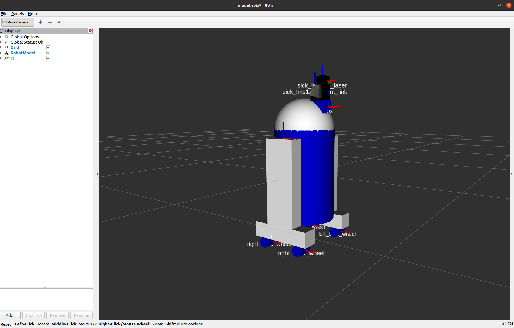

Visualizing
============

One of the features of the Generic Robot ROS package is visualizing your robot's model, the various sensors sensors attached to it, and the sensors' data in ``rviz``.

To use this feature, simply launch the ``view_model.launch`` file provided in the Generic Robot ROS package and provide the ``description_launch`` argument with the path to your robot's ``.launch`` file. The ``view_model.launch`` file can be found `here <https://github.com/jyang-cpr/generic_robot/blob/noetic-devel/launch/view_model.launch>`_.

For example, you can view the model of the example ``generic_robot.urdf.xacro`` robot along with the Hokuyo UST-10LX 2D laser scanner attached to it. In terminal, run:

.. code-block:: bash

  roslaunch generic_robot view_model description_launch:=/home/administrator/catkin_ws/src/generic_robot/example/description.launch

Once ``rviz`` loads, you should see the model of the example generic robot, along with the Hokuyo UST-10LX 2D laser scanner mounted ontop of the ``box`` link.

In addition, you can also add the ``/scan`` ROS topic to ``rviz`` to see the 2D laser scans from the Hokuyo UST-10LX 2D laser scanner.

.. image:: images/generic_robot_scan_rviz.png
    :alt: Generic Robot Scan Rviz