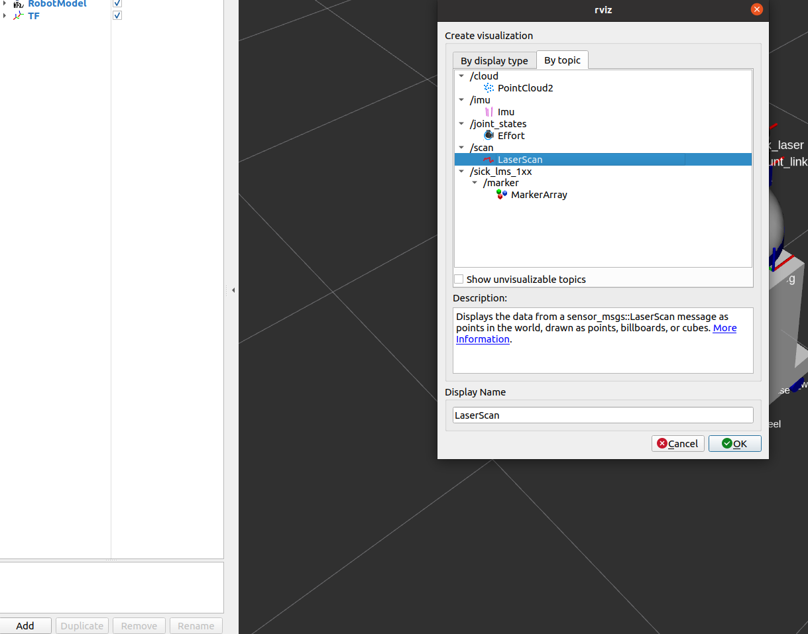

Visualizing with Rviz
======================

After setting up your robot and adding the sensors you want, you can now visualize your robot's updated model in ``rviz``. In addition, if you have the physical sensors and included the launching of their drivers, you can also visualize your sensors' data.

The Robot Customizer ROS package provides a useful ``.launch`` file for visualization in ``rviz``. This file is called ``rviz.launch``, and can be found `here <https://github.com/clearpathrobotics/cpr_robot_customizer/blob/noetic-devel/launch/rviz.launch>`_.

To use it, simply launch ``rviz.launch`` and provide the ``description_launch`` argument with the path to your robot's ``.launch`` file. For example, you can visualize the model of the example ``generic_robot.urdf.xacro`` robot along with the SICK LMS1xx 2D laser scanner attached to it. In terminal, run:

.. code-block:: bash

  roslaunch cpr_robot_customizer rviz.launch description_launch:=/home/administrator/catkin_ws/src/cpr_robot_customizer/example/description.launch

Once ``rviz`` loads, you should see the model of the example generic robot, along with the SICK LMS1xx 2D laser scanner mounted ontop of the ``box`` link.

.. image:: images/rviz.png
    :alt: Robot Customizer Rviz

In addition, if you have the physical sensor setup, you can also add the ``/scan`` ROS topic to ``rviz`` to see the 2D laser scans from the SICK LMS1xx 2D laser scanner.

